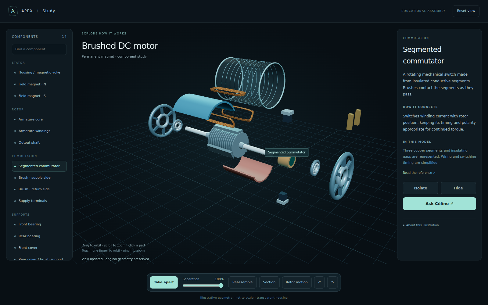

# Apex assembly study

The first study is an original, simplified permanent-magnet brushed DC motor.
Its 14 named component groups can be selected, separated, isolated, hidden and
reassembled. The graphite/cyan workspace keeps the model central, with a
searchable component tree and a contextual inspector.

## Use it

Open **Motor study** from `/board`. This pauses board hand actions before
navigating; release any held board object first. Returning to the board leaves
hands paused until you resume them. Direct navigation to `/study` is also
supported but does not change board hand controls in other windows.

Drag to orbit, scroll to zoom, or use touch orbit/pinch. Click a component in
the view or list. Use **Take apart**, the separation slider, **Isolate**,
**Hide**, **Show all**, **Reassemble**, and undo/redo. **Section** clips the
geometry without capping the cut. **Rotor motion** is illustrative and requires
the model to be assembled. Reset view restores the camera.

**Ask Céline** opens the existing companion with the selected study session.
The server supplies the current part, sources and model limitations for each
turn. The `assembly_study` tool lets the companion open the motor study or
change its selection/view. An active board follows the open-study event.
For example, ask to open a brushed DC motor, then ask to isolate its commutator.
Actual microphone, provider response quality and voice latency still need
testing on the user's device; tool execution and context delivery are tested.

## Fidelity and persistence

- Geometry is authored for explanation, not manufacturer CAD or fabrication.
  It is not to scale and contains no validated dimensions or tolerances.
- Windings are grouped illustrations; electrical connections, brush timing,
  magnetic fields, loads and performance are not simulated.
- This milestone supports one curated motor. It does not generate arbitrary
  detailed assemblies from a prompt or split an arbitrary mesh into real parts.
- Study navigation uses mouse/touch. Hand control in this camera/view is still
  pending. The board's existing gesture controller is a separate view.
- Sessions and undo history are in memory: a restart or eviction loses them.
  There are at most 32 recent sessions, with 40 undo steps per session. Reloading
  an expired session opens a new assembly and reports that reset.
- The study uses the existing shared dashboard token. It is not multi-user
  tenant isolation. Model/session APIs require authentication; mutations check
  request origin. Static shell/Three.js assets are served locally.

Component descriptions cite Nidec's motor glossary in the inspector and model
manifest: [DC motor construction](https://www.nidec.com/en/technology/motor/glossary/item/construction_of_a_dc_motor/),
[commutator](https://www.nidec.com/en/technology/motor/glossary/item/commutator/),
[commutation](https://www.nidec.com/en/technology/motor/glossary/item/commutation/),
and [carbon brush](https://www.nidec.com/en/technology/motor/glossary/item/carbon_brush/).
These support component explanations, not the dimensions of this original model.

## Verification and next acceptance

Python checks cover part/source consistency, reversible views, independent and
bounded sessions, invalid commands, auth/origin checks, server-resolved context
and tool execution. Run `python -m pytest tests/test_assembly_study.py -q`.
The companion DOM check `node scripts/check_companion_in_board_ui.cjs --assembly`
checks trusted messages and the session sent with the question (requires jsdom).

A real Chromium/real server check exercised loading all 14 components,
explosion, selection, isolation, hide/reassemble, rotor/section/undo, reflected
server commands, companion opening and a 390px viewport without horizontal
overflow or JavaScript page errors. The preview uses isolated example data.

Next: validated assembly assets and deeper component hierarchy; saved study
projects; camera-aware hand selection with explicit input ownership; then real
device voice/gesture and extended-session comfort testing.
