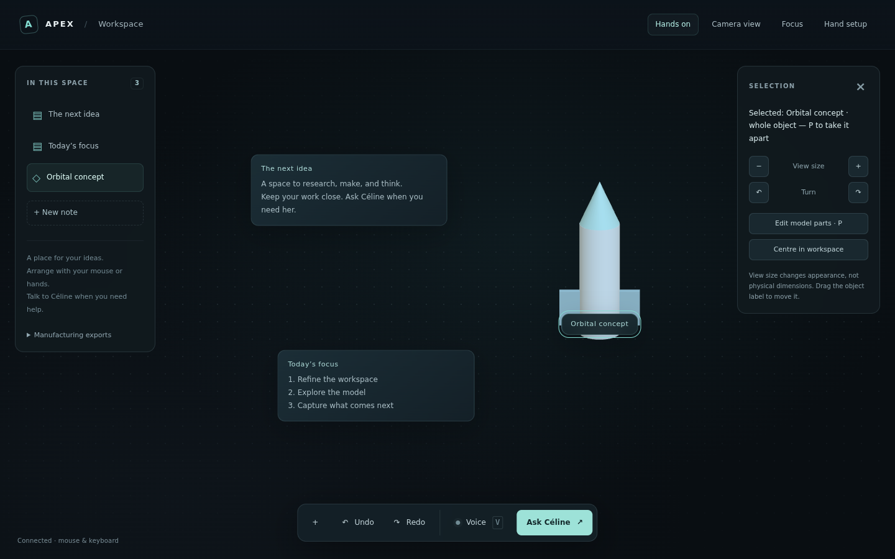

# Apex daily workspace

Goal: Alex should want Apex present throughout real work. Hands, mouse, keyboard
and voice are complementary inputs. A calm interface, dependable selection,
recoverable actions and continuity matter more than decorative effects.

## Delivery sequence

1. **Comfortable workspace foundation (this branch).** Clean digital canvas,
   optional camera backdrop, quiet hand indicators, hidden-by-default setup,
   object list, notes, selection controls, mouse/touch dragging, keyboard nudges,
   undo/redo, focus layout, and a server-side hand-action pause. Keep existing
   voice/parts/calibration/export capabilities. UI preferences persist locally;
   content uses the existing board database. A Railway volume is still required
   for durable cloud storage. This is a browser workspace, not a desktop overlay.
2. **Explorable assemblies and dependable spatial manipulation.** The first
   [motor study](ASSEMBLY_STUDY.md) is implemented on this branch: a separate
   mouse/touch 3D view, 14 component groups, reversible exploded views,
   sourced explanations and selected-part companion context. It is educational
   geometry, not arbitrary detailed model generation. Next add validated CAD
   assets with assembly metadata and connect hand picking to the 3D camera.
   Tune against Alex's recorded gestures;
   measure false grabs, target selection, release success and perceived delay.
   Add visible hover/armed/grabbed states and resolve input ownership. Implement
   camera orbit, depth, axis constraints and physical versus view transforms
   together with matching picking. Preserve undo and existing assets.
3. **Project continuity.** Named workspaces, project-linked files/notes/links,
   resumable layouts, version history and explicit save/error feedback. Test
   restart, backup and restore on both laptop and cloud.
4. **Daily work integration.** Existing applications remain usable. Start with
   supported links/files and explicit screen-sharing context; evaluate a native
   companion/overlay for Windows. A browser cannot embed/control arbitrary
   desktop apps or bypass sites' iframe restrictions. Require truthful tool
   evidence for every app action.
5. **Polish against real tasks.** Complete an Apex coding task, a Sky Light
   planning task and a model-editing task. Remove unnecessary gestures and UI.

## First milestone acceptance

- With no camera, create/select/move a note and undo/redo it.
- Move a model by its label; resize and turn its view with visible controls.
- Focus and camera-background preferences survive reloads.
- Paused hand controls cannot grab, point at objects, or trigger gesture actions;
  pausing during a hold refuses and asks for release. It does not stop the camera.
- Voice and parts workflows keep their existing behavior.
- No claim of all-day readiness from simulated tests. Real laptop camera,
  touch/voice, long-session comfort and GPU checks remain user acceptance.

## Deliberate limits of milestone 1

No arbitrary-app embedding, native overlay, project switching, camera orbit,
new 3D depth editing, imported mesh segmentation or cloud/laptop synchronization.
Mouse dragging moves whole objects using their cards/labels; existing hand
controls edit generated model parts. Hand pause is shared across board clients
and resets on server restart. Only presentation preferences are per browser.

## Preview and verification

The screenshot uses example content in an isolated local server. Chromium
verified authenticated note creation, mouse drag and undo, hand pause, focus
preference restoration, model rendering, and a 390px viewport without horizontal
overflow or JavaScript page errors. This does not measure real camera/voice
latency, laptop GPU performance or long-session comfort.

Targeted Python checks: `python -m pytest tests/test_daily_workspace.py
 tests/test_board.py tests/test_board_jarvis.py tests/test_board_parts.py
 tests/test_board_tap.py tests/test_handtrack.py -q` (run as one command).
UI checks: `node scripts/check_daily_workspace_ui.cjs` and existing board
HUD/parts/voice/companion/drive checks; jsdom must be available on NODE_PATH.
